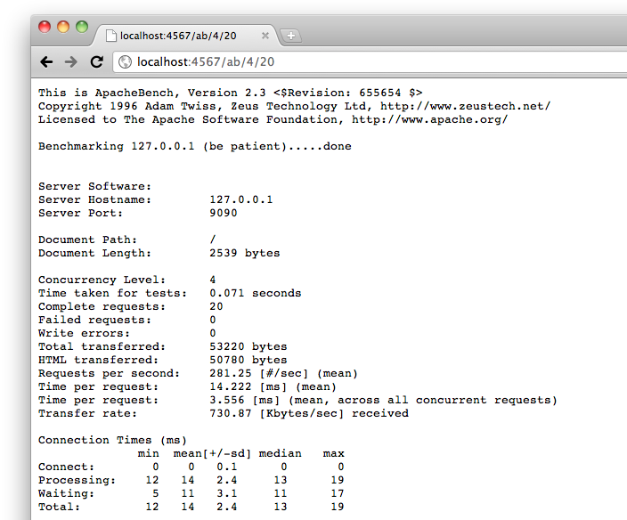

!SLIDE code
    @@@ Ruby
		get '/ab/:c/:n' do
		  n = params[:n].slice(/\d{1,5}/)
		  c = params[:c].slice(/\d{1,5}/)
		  u = "http://127.0.0.1:9090/"
		  @output = `ab -c #{c} -n #{n} #{u}`
		  erb :ab
		end
		__END__
		@@ab
		<pre>
		<%= @output %>
		</pre>
		
!SLIDE center

