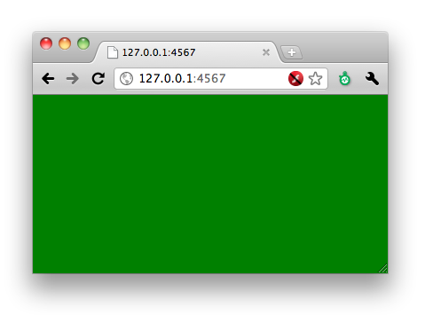
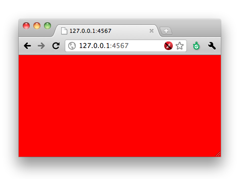

!SLIDE code
    @@@ Ruby
    get '/' do
      @output = IO.popen('echo 1').read.to_i
      @color = (@output == 1) ? "green" : "red"
      erb :index
    end
    
    __END__
    @@ index
    <meta http-equiv="Refresh" 
    content="5; url=http://127.0.0.1:4567/">
    <body style="background-color:<%=@color%>">

!SLIDE center

