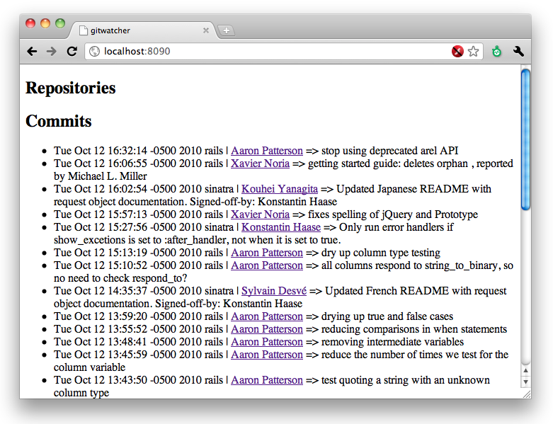

!SLIDE code
# Mix it up #
    @@@ Ruby

		finder = /\W{40}/ 
        response.gsub!(finder){|x|
		  "<a href='.../#{x}'>#{x}</a>"      
        }
		
!SLIDE center

		
!SLIDE code
# Mix it up #
    @@@ Ruby
		
		Dir.foreach('./'){|x| `cc #{x}`}