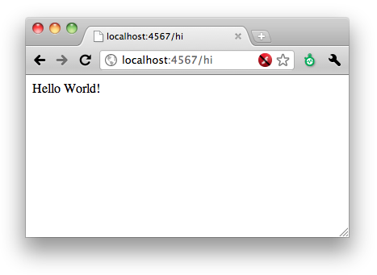

!SLIDE bullets
# Sinatra is Simple

    Well, it starts simple

!SLIDE 
# Sinatra is Simple #

    @@@ Ruby
    require 'rubygems'
    require 'sinatra'
    get '/hi' do
      "Hello World!"
    end

!SLIDE center
# Sinatra is Simple #
    $ruby hello_world.rb

!SLIDE
# Sinatra is Simple #
    Use whatever you want for the model. 
    Nothing ships with Sinatra.

    ActiveRecord
    DataMapper
    File.readlines
    Twitter::Base.new(oauth).replies

!SLIDE bullets
# Sinatra is Simple #
    builtin templating support

    ERB
    HAML
    Sass
    Builder

!SLIDE code
# Sinatra is Simple #
    @@@ Ruby
    get '/'
      erb :index
    end
    put '/hello'
      haml :hello
    end
    post '/name'
      sass :name
    end
    delete '/age'
      builder :age
    end

!SLIDE
# Sinatra is Simple #
    @@@ Ruby
    require 'rubygems'
    require 'sinatra'
    get '/hi/:name' do
      @name = params[:name]
      erb :hi
    end

    enable :inline_templates

    __END__
    @@ layout
    <html><body><%= yield %></body></html>

    @@ hi
    <h2>Hello <%= @name %>!</h2>

!SLIDE
# Aside- Sinatra can get Complex #
    Deploy to Passenger
    The sky is the limit to orms
    Can be used as middleware for a rails app

!SLIDE code
    @@@ Ruby
    class Gitter < Sinatra::Base
      get '/git' do
        @status = `git status`
        erb :git
      end
    end
    # ...
    Gitter.run